# GitHub Contribution Gravity Lens

**[日本語](README_ja.md)** | English

Turn your GitHub contribution graph into a spacetime distortion.

High-activity days become gravitational anomalies.
The grid bends. Space ripples. Your year warps.



## What is this?

GitHub Contribution Gravity Lens analyzes your contribution history, detects anomalous activity peaks, and warps the surrounding cells toward those points — like light bending around a massive object. The result is a looping animation you can embed directly in your GitHub profile or repository README.

- **SVG & GIF output** — lightweight SVG (default) or portable GIF
- **14-second loop** — ripple activation, lens warp, interference pulse, and restore
- **Dark & Light themes** — matches GitHub's default appearances
- **Anomaly detection** — automatically identifies contribution spikes and animates them

## Quick Start (GitHub Actions)

The easiest way to use this is with a GitHub Actions workflow that regenerates the animation daily. No Personal Access Token required — the workflow uses the built-in `GITHUB_TOKEN` that GitHub Actions provides automatically.

### 1. Create the workflow file

Create `.github/workflows/gravity-lens.yml` in your repository:

```yaml
name: generate gravity-lens

on:
  schedule:
    - cron: "0 0 * * *"   # daily at 00:00 UTC
  workflow_dispatch:
  push:
    branches: [ main ]

permissions:
  contents: write

concurrency:
  group: gravity-lens
  cancel-in-progress: true

jobs:
  generate:
    runs-on: ubuntu-latest
    timeout-minutes: 10

    steps:
      - uses: actions/checkout@v4

      - uses: actions/setup-node@v4
        with:
          node-version: "20"

      - name: Clone gravity-lens tool
        run: git clone https://github.com/Rujuu-prog/github-contribution-gravity-lens.git tool

      - name: Build tool
        run: |
          cd tool
          npm ci
          npm run build

      - name: Generate (dark + light)
        env:
          GITHUB_TOKEN: ${{ github.token }}
        run: |
          mkdir -p dist
          node tool/dist/cli.js \
            --user "${{ github.repository_owner }}" \
            --token "$GITHUB_TOKEN" \
            --theme dark \
            --format svg \
            --output "dist/gravity-lens-dark.svg"

          node tool/dist/cli.js \
            --user "${{ github.repository_owner }}" \
            --token "$GITHUB_TOKEN" \
            --theme light \
            --format svg \
            --output "dist/gravity-lens.svg"

      - name: Deploy to output branch
        uses: crazy-max/ghaction-github-pages@v3.2.0
        with:
          target_branch: output
          build_dir: dist
        env:
          GITHUB_TOKEN: ${{ github.token }}
```

> **Note:** This workflow clones and builds the tool from source. Once the package is published to npm, you will be able to replace the clone/build steps with a single `npx github-contribution-gravity-lens` command.

> **Note:** `github.token` is automatically provided by GitHub Actions — no setup required. If you need to include private contributions, you may need to create a [Personal Access Token](https://docs.github.com/en/authentication/keeping-your-account-and-data-secure/managing-your-personal-access-tokens) and store it as a repository secret instead.

### 2. Add the image to your README

Use the `<picture>` element to automatically switch between dark and light themes:

```html
<picture>
  <source media="(prefers-color-scheme: dark)" srcset="https://raw.githubusercontent.com/<USER>/<REPO>/output/gravity-lens-dark.svg">
  <source media="(prefers-color-scheme: light)" srcset="https://raw.githubusercontent.com/<USER>/<REPO>/output/gravity-lens.svg">
  /<REPO>/output/gravity-lens.svg">
</picture>
```

Replace `<USER>/<REPO>` with your GitHub username and repository name (e.g. `octocat/octocat`).

### 3. Run

Trigger the workflow manually from the **Actions** tab, push to `main`, or wait for the daily cron schedule. The generated images are deployed to the `output` branch.

## CLI Options

| Flag | Description | Default |
|------|-------------|---------|
| `-u, --user <username>` | GitHub username | *(required)* |
| `-t, --token <token>` | GitHub personal access token (or set `GITHUB_TOKEN` env) | *(required)* |
| `-d, --demo` | Generate with demo data (no token needed) | `false` |
| `--theme <theme>` | Color theme: `dark` or `light` | `dark` |
| `--strength <number>` | Warp strength multiplier | `0.35` |
| `--duration <number>` | Animation duration in seconds | `14` |
| `--clip-percent <number>` | Percentile clip for normalization | `95` |
| `--format <format>` | Output format: `svg` or `gif` | `svg` |
| `-o, --output <path>` | Output file path | `gravity-lens.<format>` |

## Configuration Examples

**Light theme SVG:**

```bash
node dist/cli.js --user octocat --token "$TOKEN" --theme light
```

**GIF format:**

```bash
node dist/cli.js --user octocat --token "$TOKEN" --format gif
```

**High warp strength:**

```bash
node dist/cli.js --user octocat --token "$TOKEN" --strength 0.5
```

**Demo mode (no token required):**

```bash
node dist/cli.js --demo --theme dark --format svg
```

## Programmatic API

You can also use the rendering functions directly in your own code:

```typescript
import { fetchContributions } from 'github-contribution-gravity-lens';
import { renderSvg } from 'github-contribution-gravity-lens';
import { renderGif } from 'github-contribution-gravity-lens';

const days = await fetchContributions('octocat', process.env.GITHUB_TOKEN!);

// SVG
const svg = renderSvg(days, { theme: 'dark', strength: 0.35, duration: 14 });

// GIF
const buffer = await renderGif(days, { theme: 'dark', strength: 0.35, duration: 14 });
```

> **Note:** The package is not yet published to npm (`private: true`). Clone and build locally to use the API.

## How It Works

1. **Fetch** — Pull the last year of contribution data via the GitHub GraphQL API
2. **Normalize** — Map raw counts to a 0–1 scale with percentile clipping
3. **Detect anomalies** — Identify top contribution spikes as gravitational sources
4. **Compute warp** — Calculate per-cell displacement using a local lens model (R=60px influence radius)
5. **Render** — Generate a 14-second looping animation with five phases:
   - **Rest** (0–2s) — Static grid
   - **Awakening** (2–8s) — Brightness ripple propagates left to right
   - **Lens** (2.5–10s) — Warp ramps up per anomaly with staggered timing
   - **Interference** (8–11s) — Sine pulse between nearby anomalies
   - **Restore** (11–14s) — All effects smoothly return to zero

## License

MIT
