# テーマ

[English](themes.md)

6つのビルトインテーマ。`--theme <名前>` で選択。

---

## `github`

デフォルト。クラシックなGitHubダークグリーン。

```bash
--theme github
```



---

## `deep-space`

深い青の宇宙パレット。ワープ効果が強く、ピーク輝度も高い。

```bash
--theme deep-space
```


---

## `monochrome`

グレースケールのミニマリズム。色よりも形。

```bash
--theme monochrome
```



---

## `solar-flare`

暖かい赤橙トーン。強烈なワープ効果。

```bash
--theme solar-flare
```


---

## `event-horizon`

ほぼ真っ黒。異常点がグリッドを歪めるまで、ほとんど見えない。

```bash
--theme event-horizon
```


---

## `paper-light`

ライト背景。GitHubのライトモードに対応。

```bash
--theme paper-light
```


---

## 後方互換性

レガシー名 `dark` / `light` も使用可能：

| レガシー | マッピング先 |
|---------|------------|
| `dark` | `github` |
| `light` | `paper-light` |

## ローカルでプレビュー生成

```bash
node dist/cli.js --demo --theme <名前>
```

`--demo` ならGitHubトークン不要。
